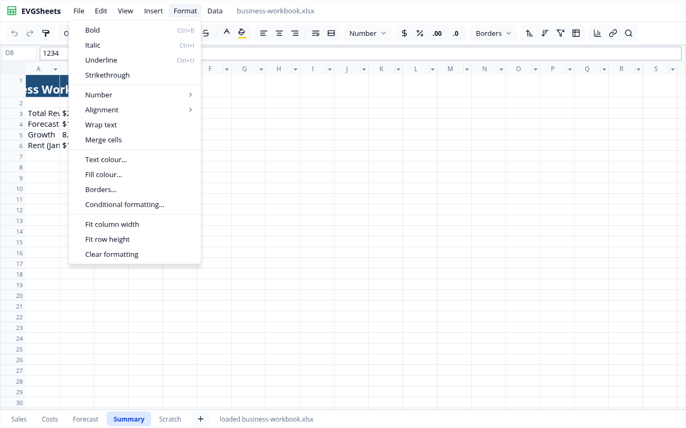
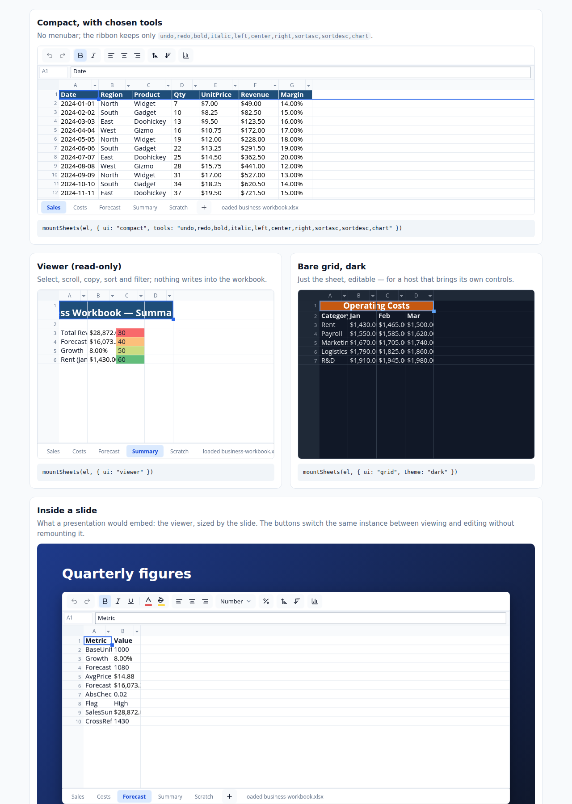

# EVGSheets

A spreadsheet editor written in [Ranger](https://github.com/terotests/Ranger).
It puts the **datagrid core** (xlsx in and out, formula engine, conditional
formats, charts, validation, find and replace, sort and filter, undo) inside
an interface built from **[EVGUI](https://github.com/terotests/EVGUI)**
controllers. **EVG** draws both into one canvas through WebGL 2.

Live: <https://terotests.github.io/EVGSheets/> ·
embeds: <https://terotests.github.io/EVGSheets/embed.html>



## What is in it

| Part | Built from |
|---|---|
| Menubar: File, Edit, View, Insert, Format (with Number and Alignment submenus), Data | `MenubarCtl` / `MenuCtl` |
| Ribbon: undo/redo, format painter, font and size, B I U S, text and fill colour, alignment, wrap, merge, number formats, borders, sort, filters, freeze, chart, link, find | `RibbonCtl` (an EVGUI controller in this repository) and `MenuCtl` dropdowns |
| Context menu on cells | `MenuCtl` in context mode |
| Sheet tabs and adding a sheet | `TabsCtl`, `RibbonCtl` |
| Status line: Ready / editing / what happened, and Sum, Average and Count of the selection | the app |
| Dialogs: find and replace, paste special | `WindowCtl` (modal) with `InputCtl`, `CheckboxCtl`, `RadioGroupCtl` and `ButtonCtl` (`src/SxDialog.rgr`); the work is the core's |
| Formula bar, grid, the other dialogs (colours, borders, chart picker, conditional formats, validation) | the datagrid core (`GridApp`) |
| Light and dark | `@vars` palettes in `src/sheets.css`; the core's `modern` and `dark` grid themes |

The two halves meet at the display list. The page is laid out by EVG, and
the element `sx-grid` is a placeholder whose rectangle becomes `GridApp`'s
window. `GridApp`'s own frame is painted into that element with
`EVGDisplayList.paintAt`, so menus drop over the grid and the grid's dialogs
stay inside it.

State is not duplicated. The Bold button is pressed because the core says
the active cell is bold, and that is read again after every input.

### Accessibility

The chrome's accessibility tree comes from UiHost and the core's from
`GridApp`. They are merged into one tree, with the core's nodes under a
"Spreadsheet" region at the grid's rectangle. `gl/evg-a11y.js` mirrors that
tree as real DOM over the canvas.

- **Ribbon:** each group is a `toolbar` with roving focus. Toggle buttons
  report `aria-pressed`.
- **Menus:** they behave as Radix menus do.
- **Status line:** it is a live region.
- **Keyboard:**
  - F6 moves between the menubar, the ribbon, the sheet and the tabs.
  - F10 goes to the menubar.
  - Escape returns to the sheet.
  - Ctrl chords reach the sheet from anywhere.

## Parameters

You choose which parts appear, which ribbon tools exist, and whether the
workbook can be edited. Set these as URL parameters on the editor page, or as
options to `mountSheets`.

| Option | Values | |
|---|---|---|
| `ui` | `full` · `compact` · `viewer` · `grid` | Presets. `viewer` is read-only with tabs and status only; `grid` is the bare sheet. |
| `tools` | comma list, e.g. `bold,italic,sortasc` | The ribbon tools to keep. |
| `readOnly` | `true` / `false` | Read-only still allows select, scroll, copy, find, sort and filter. |
| `menubar`, `ribbon`, `formulaBar`, `tabs`, `status`, `title` | `true` / `false` | Show or hide each part. |
| `theme` | `light` · `dark` | Defaults to the system setting. |
| `xlsx`, `name`, `sheet` | URL, file name, sheet name | The workbook to open, and the sheet to show first. |
| `demo` | (no value) | Open the sample business workbook. Without `demo` or `xlsx` the editor starts with an empty workbook. |

Ribbon tool names: `undo redo painter font size bold italic underline strike color fill left center right wrap merge numfmt currency percent decmore decless borders sortasc sortdesc filterclear freeze chart link find`.

Examples: [`?ui=compact&theme=dark`](https://terotests.github.io/EVGSheets/?ui=compact&theme=dark),
[`?ui=viewer`](https://terotests.github.io/EVGSheets/?ui=viewer),
[`?tools=bold,italic,sortasc,chart&menubar=false`](https://terotests.github.io/EVGSheets/?tools=bold,italic,sortasc,chart&menubar=false).

## Embedding

```js
import { mountSheets } from "https://terotests.github.io/EVGSheets/evgsheets.mjs";

const sheet = await mountSheets(element, {
  ui: "viewer",
  xlsx: arrayBufferOrUrl,
  base: "https://terotests.github.io/EVGSheets/",
});
await sheet.setPreset("compact"); // switch to editing in place
const bytes = sheet.saveBytes();  // the workbook as .xlsx
sheet.state();                    // active cell, formats, sheets, selection sum…
sheet.destroy();
```

`mountSheets` can also take these callbacks:

- `onSave(bytes, name)`: take the file yourself instead of downloading it.
- `onChange()`: called, debounced, after edits.
- `onKey(ev)`: return `false` to keep a key away from the sheet. A host such as
  a presentation uses this to keep its own keys.

Each mount has its own canvas and keyboard. The engine and fonts are fetched
once per page.



## Building

The sources expect to sit at `gallery/evgsheets/` in a Ranger checkout. That
checkout also needs `gallery/datagrid` (the core) and `gallery/evgui` (EVGUI).
`scripts/build.mjs` puts everything in place and compiles with Ranger's
committed compiler:

```sh
git clone https://github.com/terotests/Ranger
git clone https://github.com/terotests/EVGUI
git clone https://github.com/terotests/EVGSheets
cd EVGSheets
npm install                 # esbuild (minifies) and playwright-core (the smoke test)
node scripts/build.mjs      # → dist/
node scripts/smoke.mjs      # opens dist/ in Chromium and uses it
python3 -m http.server -d dist 8000
```

`build.mjs` looks for each checkout in this order:

- **Ranger:** `--ranger`, then `$RANGER_DIR`, then the enclosing checkout, then
  `../Ranger`.
- **EVGUI:** `--evgui`, then `$EVGUI_DIR`, then `../EVGUI`. If none is found, it
  clones EVGUI.

It runs Ranger's `scripts/deps.mjs`, which fetches `lib/evg`.

`.github/workflows/pages.yml` builds from sparse checkouts and runs the smoke
test. It publishes `dist/` to GitHub Pages from the default branch; Pages must
be set to deploy from GitHub Actions (Settings → Pages → Source).

## Files

- `src/SheetsApp.rgr`: the app. It holds the page tree, the menus and ribbon,
  the parameters, input routing, the merged display list and the merged
  accessibility tree.
- `src/RibbonCtl.rgr`: a ribbon group as an EVGUI controller.
- `src/sheets.css`: the look, in light and dark.
- `web/evgsheets.mjs`: `mountSheets`, the browser host. It handles WebGL,
  events, the a11y mirror, the clipboard and files.
- `web/index.html`, `web/embed.html`: the site.
- `scripts/build.mjs`, `scripts/smoke.mjs`: the build and the browser test.

**License:** AGPL-3.0-or-later.
